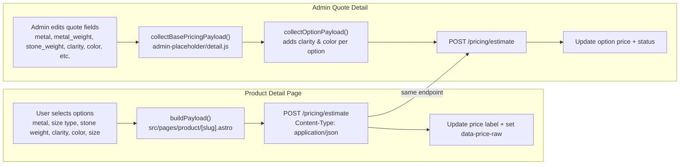

# Price Estimate Flow

This document describes how the frontend and admin UI build and send pricing estimate payloads to the pricing API, and how the UI updates with the response. It reflects the client-side behavior in this repo (there is no server-side formula documented here).

## Overview



## Frontend (Product Detail Page)

Source: `src/pages/product/[slug].astro`

### When a request is sent
- User changes any pricing-affecting option (metal, stone, size type, stone weight, metal weight, clarity, color, size).
- The UI calls `apply(false)` which builds and sends the payload.

### Payload fields
The payload is built in `buildPayload()` and includes:
- `metal`: selected metal (defaults to lowest karat metal if no selection).
- `metal_weight`: metal weight resolved from size type selection or metal weight select.
- `stone`: selected stone type (if available).
- `stone_weight`: if the stone weight is a breakdown, send total carats; otherwise the raw value.
- `diamond_breakdown`: only populated when the stone weight is a breakdown.
- `size`: primary size value (chain size preferred if present).
- `size_label`: label for the size field.
- Optional: `timeline`, `timeline_adjustment_weeks` (if present in the UI).

### Response handling
- On success, sets `data-price-raw` and replaces the price label with formatted USD.
- On failure, resets to the fallback price label.

## Admin (Quote Detail)

Source: `admin-placeholder/detail.js`

### When a request is sent
- Pricing is triggered for active quote options.
- Each option is priced with a base payload + option-specific clarity/color.

### Base payload fields
Built in `collectBasePricingPayload()`:
- `metal`, `metal_weight`, `stone`, `stone_weight`
- `diamond_breakdown`, `diamond_breakdown_components`
- `timeline`, `timeline_adjustment_weeks`
- `quote_discount_type`, `quote_discount_percent`
- `size`, `size_ring`, `size_bracelet`, `size_chain`

### Option payload fields
Built in `collectOptionPayload()`:
- Adds `clarity` and `color` for the specific option index.

### Response handling
- On success, updates the option price and status to "priced".
- On failure, sets status to "error".

## Pricing formula (worker)
Source: `workers/herawalla-email-atelier/src/legacy.ts`

This section documents the exact calculation performed by `computeOptionPriceFromCosts()` and helpers.

### Inputs
- `record`: product/option payload (metal, metal_weight, stone_weight, diamond_breakdown, size, timeline, etc.)
- `clarity`, `color`: option-specific grade
- `costValues`: cost chart values from D1 (string numbers)
- `diamondPrices`: price-per-carat table entries
- `discountDetails`: optional override; otherwise defaults from cost chart

### Step-by-step
```text
1) Size adjustments (adds grams to metal weight)
   chainAdjustment = max(0, chainLength - chainBase) * chainStep
   braceletAdjustment = max(0, braceletLength - braceletBase) * braceletStep
   ringAdjustment = max(0, ringSize - ringBase) * ringStep
   sizeAdjustment = chainAdjustment + braceletAdjustment + ringAdjustment
   adjustedMetalWeight = metal_weight + sizeAdjustment (only if sizeAdjustment > 0)

2) Diamond pieces
   pieces = diamond_breakdown components if present
   else fallback to stone_weight as a single piece

3) Metal cost
   metalCostPerGram = costValues[price_gram_<karat>] or gold_price_per_gram_usd fallback
   metalCost = adjustedMetalWeight * metalCostPerGram

4) Diamond cost (per piece)
   pricePerCt = lookup by clarity/color/weight bracket
   labMultiplier = costValues[lab_diamonds_relative_cost_pct] or 0.20 default
   pieceCost = pricePerCt * weight * count * (labMultiplier if lab else 1)
   diamondCost = sum(pieceCost)

5) Labor
   laborBase = labor_flat
             + labor_per_gram * adjustedMetalWeight
             + labor_per_ct * totalCaratWeight
             + labor_per_piece * totalPieces
   laborCost = laborBase * (1 + labor_margin_percent)

6) Material cost
   materialCost = metalCost + diamondCost

7) Risk
   riskCost = (materialCost + laborCost) * dollar_risk_pct

8) Time + Rush
   timeCost = time_cost_flat + time_cost_per_week * timeline_adjustment_weeks
   rushFee = (timeline contains "rush")
           ? materialCost * rush_fee_percent + rush_fee_flat
           : 0

9) Production cost
   productionCost = (materialCost + laborCost) * (1 + profit_margin_production_pct)

10) Tariff
    tariffBase = productionCost + shipping_cost
    tariffCost = tariffBase * tariff_percent

11) Base cost
    baseCost = productionCost + tariffCost + shipping_cost + timeCost + riskCost + rushFee

12) Sales margin + premium
    priceWithMargin = baseCost * (1 + price_premium_pct + profit_margin_sales_pct)

13) Discount + rounding
    finalPrice = priceWithMargin * (1 - discount_percent)
    estimated_price = round(finalPrice)
```

### Key cost chart fields
- Metal: `price_gram_24k`, `price_gram_18k`, `price_gram_14k`, or `gold_price_per_gram_usd`
- Diamond: `lab_diamonds_relative_cost_pct`
- Labor: `labor_flat`, `labor_per_gram`, `labor_per_ct`, `labor_per_piece`, `labor_margin_percent`
- Risk: `dollar_risk_pct`
- Time: `time_cost_flat`, `time_cost_per_week`
- Rush: `rush_fee_percent`, `rush_fee_flat`
- Shipping: `shipping_cost_usd`
- Margins: `profit_margin_production_pct`, `profit_margin_sales_pct`, `price_premium_pct`

## Notes
- The same endpoint is used by both the frontend product detail page and the admin quote tool.
- The formula above is the worker-side implementation; update this doc if `legacy.ts` changes.

## Example calculation (illustrative)

This is a worked example using the worker-side formula and **hypothetical** chart values to show how the price is computed. Replace the numbers with real values from your cost chart and diamond price chart to get an actual price.

### Example payload (Azure Solitaire)

```json
{
  "metal": "18K Yellow Gold",
  "metal_weight": "6.5",
  "stone": "Lab Grown Diamond",
  "stone_weight": "1.50",
  "clarity": "VS1",
  "color": "F",
  "timeline": "Standard",
  "timeline_adjustment_weeks": "0",
  "size": "6"
}
```

### Example chart inputs (hypothetical)

```text
gold_price_per_gram_usd = 70
18k_price_per_gram_usd  = 55
labor_flat              = 200
labor_per_gram          = 8
labor_per_ct            = 30
labor_per_piece         = 0
labor_margin_percent    = 0.10
tariff_percent          = 0.03
dollar_risk_pct          = 0.02
shipping_cost_usd       = 40
time_cost_flat_usd      = 0
time_cost_per_week_usd  = 0
rush_fee_percent        = 0
rush_fee_flat_usd       = 0
price_premium_pct       = 0.10
profit_margin_production_pct = 0.15
profit_margin_sales_pct = 0.10
lab_diamonds_relative_cost_pct = 0.20

diamond_price_chart (for VS1 / F, 1.50ct) = 3500 per ct
```

### Step-by-step

```text
1) Metal cost
   metal_weight = 6.5g
   metal_cost_per_gram = 55
   metal_cost = 6.5 * 55 = 357.50

2) Diamond cost
   diamond_weight = 1.50 ct (1 piece)
   price_per_ct = 3500
   lab multiplier = 0.20
   diamond_cost = 3500 * 1.5 * 1 * 0.20 = 1050.00

3) Labor
   labor_base = labor_flat + (labor_per_gram * metal_weight) + (labor_per_ct * total_ct)
              = 200 + (8 * 6.5) + (30 * 1.5)
              = 200 + 52 + 45 = 297.00
   labor_cost = labor_base * (1 + labor_margin_percent)
              = 297.00 * 1.10 = 326.70

4) Material cost
   material_cost = metal_cost + diamond_cost
                 = 357.50 + 1050.00 = 1407.50

5) Tariff + risk
   tariff_cost = material_cost * tariff_percent
               = 1407.50 * 0.03 = 42.23
   risk_cost = (material_cost + labor_cost) * dollar_risk_pct
             = (1407.50 + 326.70) * 0.02 = 34.68

6) Shipping + time + rush
   shipping_cost = 40
   time_cost = 0
   rush_fee = 0

7) Base cost
   base_cost = material_cost + labor_cost + tariff_cost + shipping_cost + time_cost + risk_cost + rush_fee
             = 1407.50 + 326.70 + 42.23 + 40 + 0 + 34.68 + 0
             = 1851.11

8) Margins / premium
   price_with_margin = base_cost * (1 + price_premium_pct + profit_margin_production_pct + profit_margin_sales_pct)
                     = 1851.11 * (1 + 0.10 + 0.15 + 0.10)
                     = 1851.11 * 1.35 = 2498.99

9) Discount
   applied_discount = 0 (assumed)
   final_price = price_with_margin * (1 - discount)
               = 2498.99

10) Rounded
    estimated_price = 2499
```

### How to produce a real example

Use the same payload and add `debug: true` when posting to `/pricing/estimate`. The response includes a `debug` object with computed values (metal cost per gram, chain/bracelet/ring adjustments, diamond breakdown, etc.), which you can use to plug into the steps above and produce a concrete price example.
