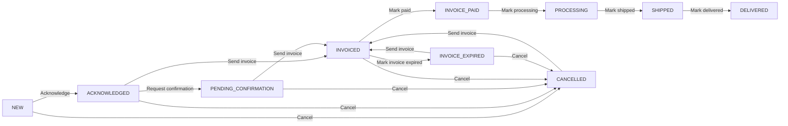

# Admin Orders - Status Workflow

- PENDING_CONFIRMATION can only be set by "Get Customer Confirmation."
- Changing price, timeline, metal, stone, or stone_weight requires confirmation.
- Mark shipped requires fulfillment details: shipping_carrier, tracking_number, certificates, care_details, warranty_details, service_details.
- Order details are stored in the order details sheet and reused in shipped/delivered emails.
