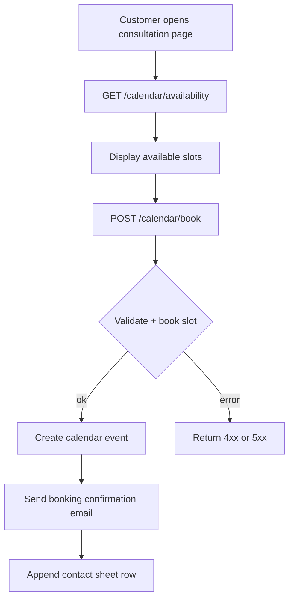

# Consultation Booking - End-to-End

```mermaid
flowchart TD
  A[Customer opens consultation page] --> B[GET /calendar/availability]
  B --> C[Display available slots]
  C --> D[POST /calendar/book]
  D --> E{Validate + book slot}
  E -- ok --> F[Create calendar event]
  F --> G[Send booking confirmation email]
  G --> H[Append contact sheet row]
  E -- error --> I[Return 4xx or 5xx]
```

- Booking enforces business hours, lead time, and buffer windows.
