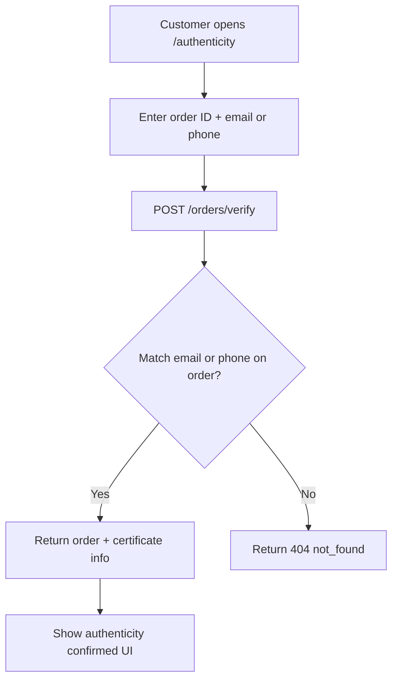

# Authenticity Verification

```mermaid
flowchart TD
  A[Customer opens /authenticity] --> B[Enter order ID + email or phone]
  B --> C[POST /orders/verify]
  C --> D{Match email or phone on order?}
  D -- Yes --> E[Return order + certificate info]
  D -- No --> F[Return 404 not_found]
  E --> G[Show authenticity confirmed UI]
```

- Certificates are read from the order details sheet.
