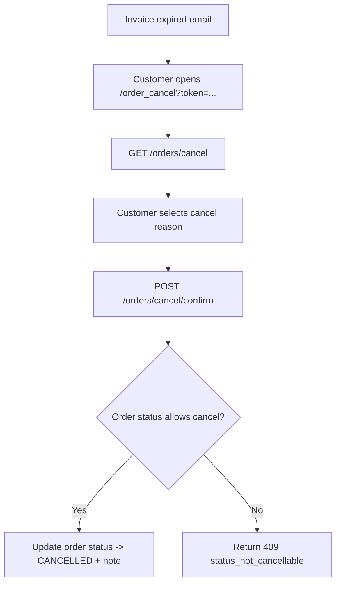

# Order Cancel - Invoice Expired CTA

```mermaid
flowchart TD
  A[Invoice expired email] --> B[Customer opens /order_cancel?token=...]
  B --> C[GET /orders/cancel]
  C --> D[Customer selects cancel reason]
  D --> E[POST /orders/cancel/confirm]
  E --> F{Order status allows cancel?}
  F -- Yes --> G[Update order status -> CANCELLED + note]
  F -- No --> H[Return 409 status_not_cancellable]
```

- Cancel requires a reason and is recorded in KV and order notes.
