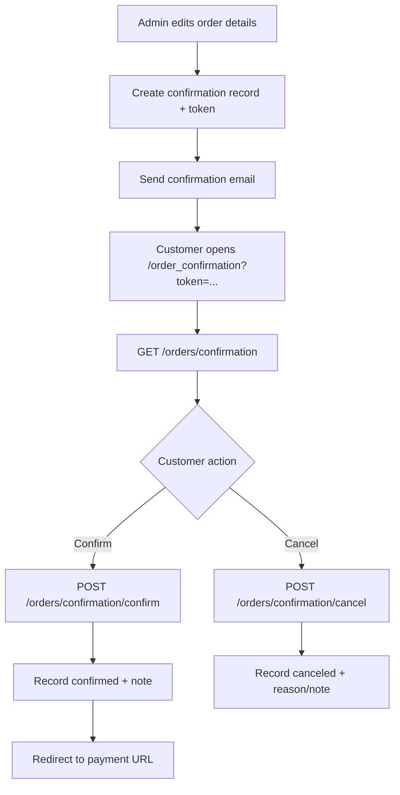

# Order Confirmation - Customer Update Approval

```mermaid
flowchart TD
  A[Admin edits order details] --> B[Create confirmation record + token]
  B --> C[Send confirmation email]
  C --> D[Customer opens /order_confirmation?token=...]
  D --> E[GET /orders/confirmation]
  E --> F{Customer action}
  F -- Confirm --> G[POST /orders/confirmation/confirm]
  G --> H[Record confirmed + note]
  H --> I[Redirect to payment URL]
  F -- Cancel --> J[POST /orders/confirmation/cancel]
  J --> K[Record canceled + reason/note]
```

- Confirmation links are one-time and stored in KV with a TTL.
- Status is set to PENDING_CONFIRMATION when the confirmation email is sent.
