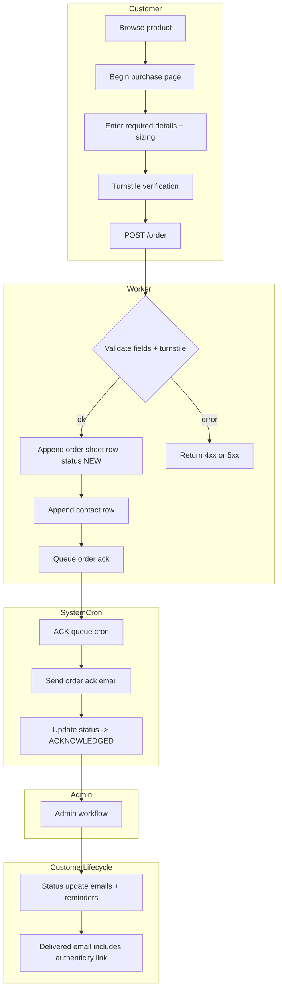

# Orders - End-to-End

- Admin workflow details are in `docs/workflows/admin-orders.md`.
- Confirmation and cancel flows are in `docs/workflows/order-confirmation.md` and `docs/workflows/order-cancel.md`.
- Shipping, certificates, care, warranty, and service details are stored in the order details sheet.
