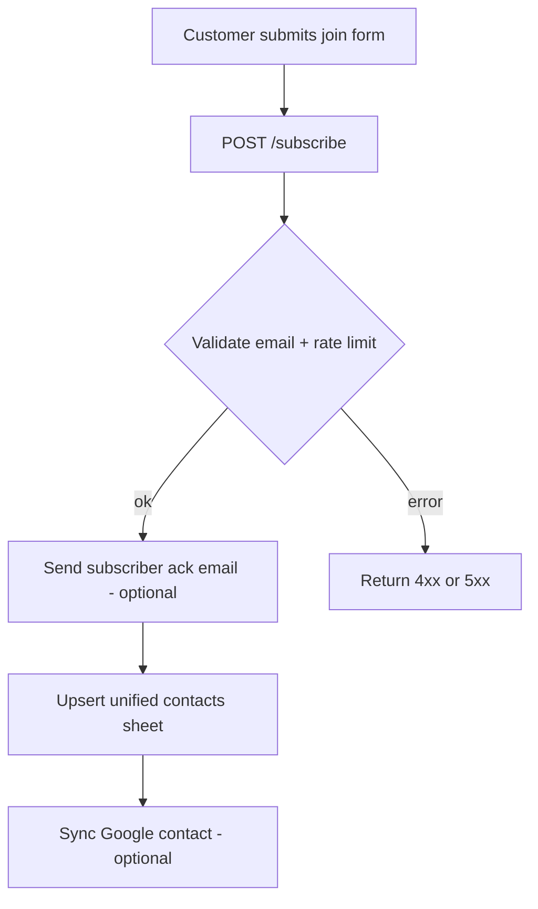

# Subscribe (Join) - End-to-End

```mermaid
flowchart TD
  A[Customer submits join form] --> B[POST /subscribe]
  B --> C{Validate email + rate limit}
  C -- ok --> D[Send subscriber ack email - optional]
  D --> E[Upsert unified contacts sheet]
  E --> F[Sync Google contact - optional]
  C -- error --> G[Return 4xx or 5xx]
```

- Email domain checks and rate limits apply.
- Subscriptions are recorded in the unified contacts sheet (no KV storage).
