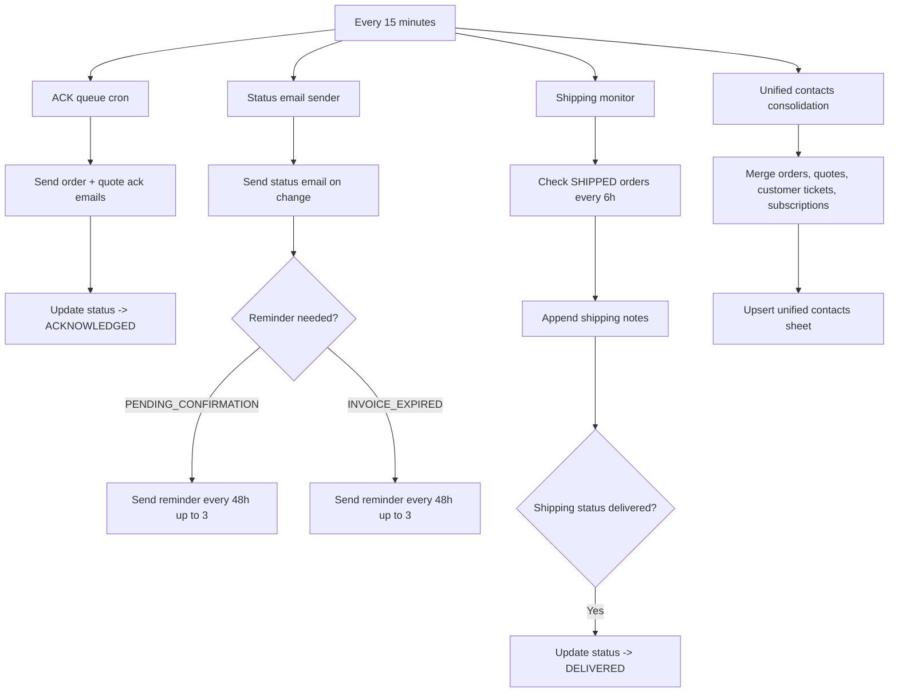

# System Jobs (Cron)

- Status email reminders are only for PENDING_CONFIRMATION and INVOICE_EXPIRED.
- Shipping monitor uses the order details sheet and sets last_shipping_check_at.
- Unified contacts consolidation keeps a single contacts sheet up to date across sources.
